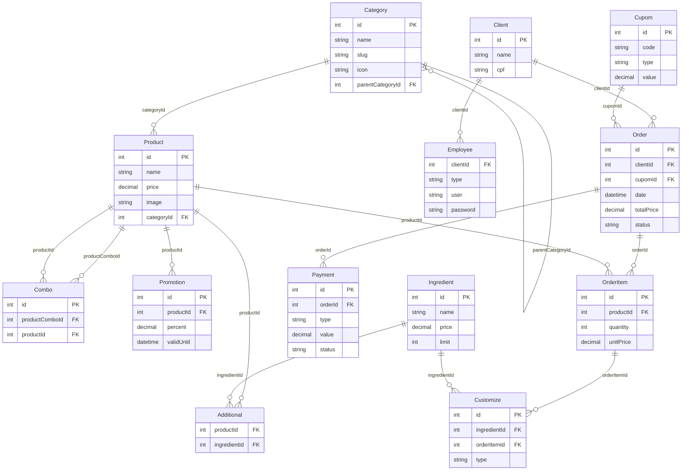

# Diagrama Entidade Relacionamento

## DER Mermaid

## **Category**
| Campo | Tipo | Descrição |
|-------|------|-----------|
| id | int | PK |
| name | string | Nome da categoria |
| slug | string | Slug/URL |
| icon | string | Ícone |
| parentCategoryId | int | FK para Category (auto-relacionamento) |

## **Product**
| Campo | Tipo | Descrição |
|-------|------|-----------|
| id | int | PK |
| name | string | Nome do produto |
| price | decimal | Preço |
| image | string | Imagem |
| categoryId | int | FK para Category |

## **Combo**
| Campo | Tipo | Descrição |
|-------|------|-----------|
| id | int | PK |
| productComboId | int | FK para Product (produto principal do combo) |
| productId | int | FK para Product (produto incluído no combo) |

## **Promotion**
| Campo | Tipo | Descrição |
|-------|------|-----------|
| id | int | PK |
| productId | int | FK para Product |
| percent | decimal | Percentual de desconto |
| validUntil | datetime | Data de validade |

## **Ingredient**
| Campo | Tipo | Descrição |
|-------|------|-----------|
| id | int | PK |
| name | string | Nome do ingrediente |
| price | decimal | Preço adicional |
| limit | int | Limite de uso |

## **Additional**
| Campo | Tipo | Descrição |
|-------|------|-----------|
| productId | int | FK para Product |
| ingredientId | int | FK para Ingredient |

## **Client**
| Campo | Tipo | Descrição |
|-------|------|-----------|
| id | int | PK |
| name | string | Nome do cliente |
| cpf | string | CPF |

## **Employee**
| Campo | Tipo | Descrição |
|-------|------|-----------|
| clientId | int | FK para Client |
| type | string | Tipo de funcionário |
| user | string | Usuário |
| password | string | Senha |

## **Cupom**
| Campo | Tipo | Descrição |
|-------|------|-----------|
| id | int | PK |
| code | string | Código do cupom |
| type | string | Tipo (porcentagem/valor fixo) |
| value | decimal | Valor/percentual |

## **Order**
| Campo | Tipo | Descrição |
|-------|------|-----------|
| id | int | PK |
| clientId | int | FK para Client |
| cupomId | int | FK para Cupom (opcional) |
| date | datetime | Data do pedido |
| totalPrice | decimal | Preço total |
| status | string | Status do pedido |

## **Payment**
| Campo | Tipo | Descrição |
|-------|------|-----------|
| id | int | PK |
| orderId | int | FK para Order |
| type | string | Tipo de pagamento |
| value | decimal | Valor pago |
| status | string | Status do pagamento |

## **OrderItem**
| Campo | Tipo | Descrição |
|-------|------|-----------|
| id | int | PK |
| productId | int | FK para Product |
| quantity | int | Quantidade |
| unitPrice | decimal | Preço unitário |

## **Customize**
| Campo | Tipo | Descrição |
|-------|------|-----------|
| id | int | PK |
| ingredientId | int | FK para Ingredient |
| orderItemId | int | FK para OrderItem |
| type | string | Tipo de personalização (adicionar/remover) |

## **Relacionamentos Resumidos**
- **Category** → **Product** (1:N)  
- **Product** → **Combo** (1:N, auto-relacionamento)  
- **Product** → **Promotion** (1:N)  
- **Product** ↔ **Ingredient** (N:N via **Additional**)  
- **Client** → **Employee** (1:1)  
- **Client** → **Order** (1:N)  
- **Order** → **OrderItem** (1:N)  
- **OrderItem** ↔ **Ingredient** (N:N via **Customize**)  
