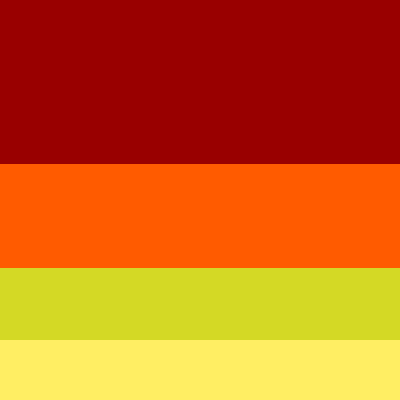

# Totem Interativo para Pedidos
## 1. Funcionalidades Principais
- Interface Touchscreen Intuitiva com categorias organizadas:  
- Promoções  
- Combos  
- Produtos Unitários  
- Bebidas  
- Sobremesas  
- Exibição de Produtos com imagem, preço e descrição (detalhes aparecem ao clicar no item).  
- Customização de Pedidos, permitindo que o cliente remova ou adicione ingredientes (ex: tirar alface, tomate).  
- Pagamento Integrado no próprio totem via cartão de crédito/débito, NFC (Apple Pay, Google Pay) ou Pix.  
- Impressão de Nota Fiscal diretamente no totem.  
- Integração com Estoque para controle em tempo real e evitar vendas de produtos esgotados.  

---

## 2. Acessibilidade
- Modo para Daltônicos com ajustes de contraste e indicação de cores alternativas.

## 3. Cores

Fonte: https://colorhunt.co/palette/990000ff5b00d4d925ffee63

## 4. Demais observações

Eles vão vender praticamente as mesmas coisas do totem do BK e MC então pensei em:

- Acompanhamentos
- Lanches, os nomes serão "C# Burguer", "PHP Buguer"...
- Sobremesas, serão Milk Shakes, casquinha, petit gâteau
- Bebidas, refrigerantes, sucos
- Molhos, temos mais opções do que ketchup! combos, quero nomes criativos tbm! tera a aba de cupons
- Combos (editado)

Aaahh o nome ficou como ADS Burguer!

Tamanho tela: 800x1280

Extensão: Simulador Móvel - ferramenta de teste responsiva
 